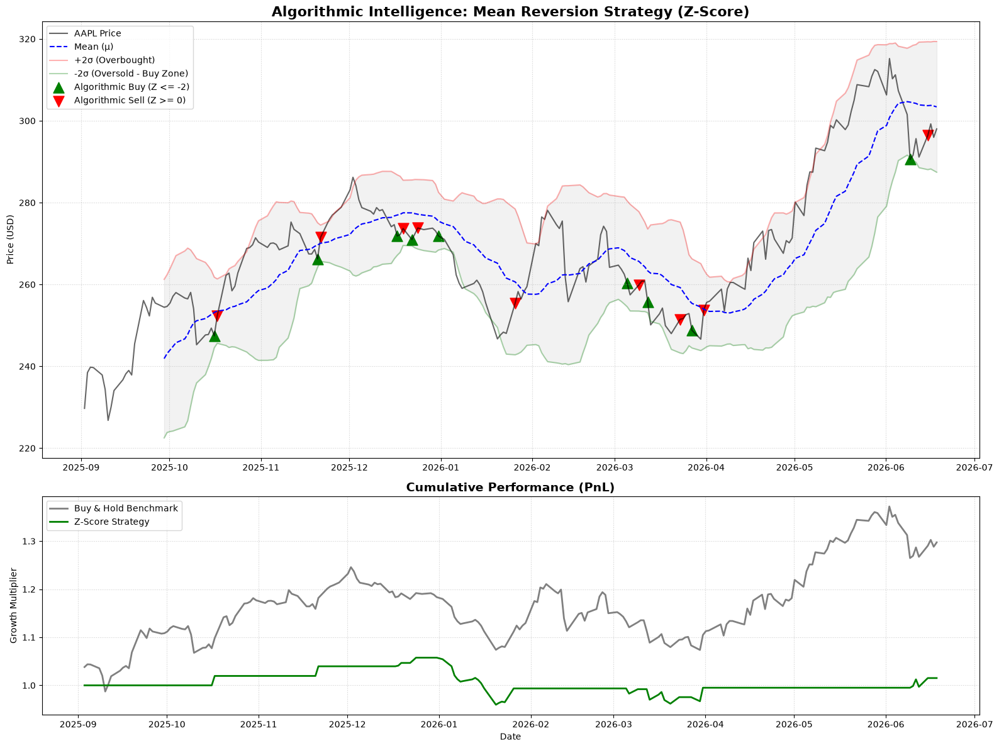
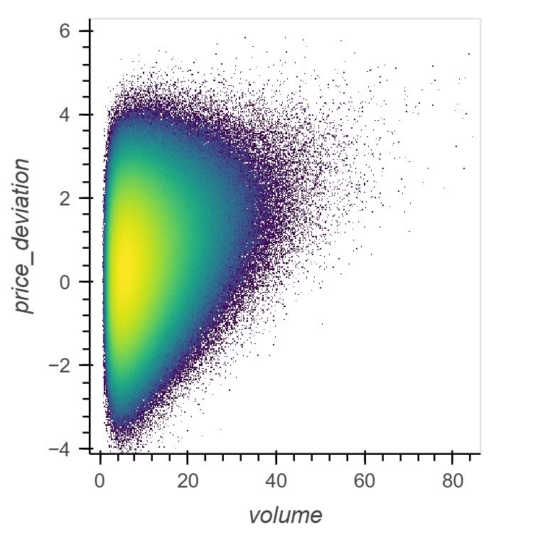
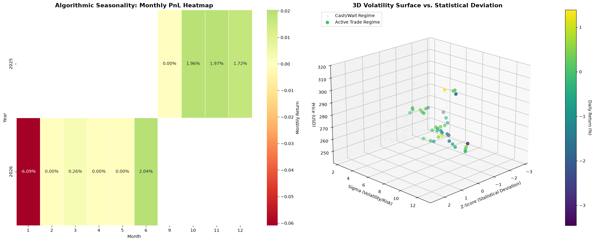
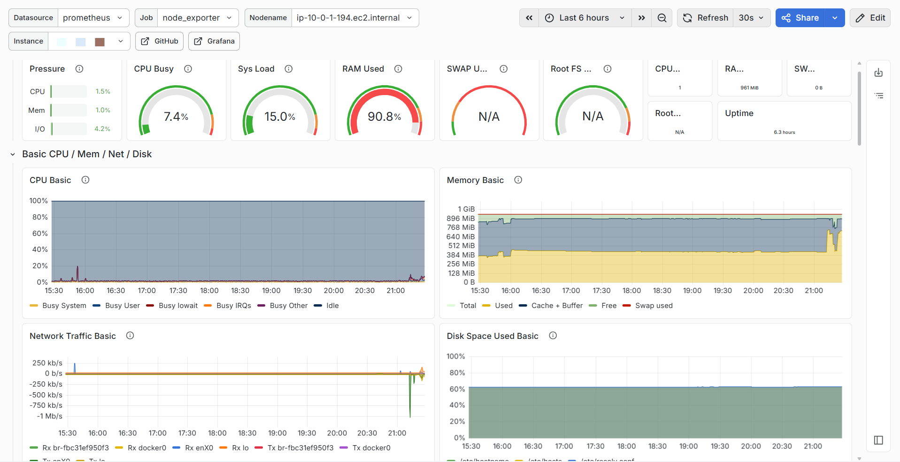

# QuantOps: Automated Statistical Arbitrage & Telemetry Engine

## Abstract
QuantOps is a Python-based algorithmic trading system designed for automated execution of a mean-reversion strategy. The system integrates real-time market data ingestion, algorithmic decision-making, and trade execution via the Alpaca API. It features a robust Site Reliability Engineering (SRE) layer, utilizing Prometheus and Grafana for system telemetry, latency tracking, and portfolio state monitoring. The infrastructure is deployed on AWS EC2 with automated CI/CD pipelines via GitHub Actions.

## System Architecture

### 1. Execution Engine
- **Language:** Python 3.10+
- **Market Data & Routing:** Alpaca Trading API (REST & WebSockets)
- **Design Pattern:** Decoupled architecture separating the mathematical evaluation layer from the execution and routing layer.
- **Fault Tolerance:** Implemented exponential backoff and retry mechanisms (`MAX_RETRIES=3`) for API rate limits and network transient failures.

### 2. Algorithmic Model
The quantitative layer operates on a standard Mean Reversion model targeting stationary assets. 
The core decision metric is the Z-Score, calculated over a rolling window ($WINDOW = 20$).

$$Z = \frac{x - \mu}{\sigma}$$

- **Entry Condition (Long):** $Z \le -2.0$ (Asset price deviates negatively by two standard deviations).
- **Exit Condition (Take Profit):** $Z \ge 0.0$ (Asset price reverts to the rolling mean).

### 3. Infrastructure & Telemetry (SRE)
- **Metrics Scraping:** Prometheus client exposes runtime metrics via HTTP (`:8000`).
- **Dashboarding:** Grafana deployed for real-time visualization.
- **Tracked Metrics:**
  - `alpaca_api_latency_seconds`: Measures API round-trip time.
  - `alpaca_orders_total`: Tracks execution success/failure rates.
  - `alpaca_account_equity_usd`: Monitors account state.

## Visual Analytics & System Performance

### Strategy Backtesting and Performance

*Figure 1: Historical simulation showing algorithmic entry/exit triggers plotted against standard deviation bands, paired with cumulative PnL benchmarking.*

### Market Microstructure

*Figure 2: Analysis of price deviation correlated with trading volume spikes.*

### Multi-Dimensional Regime Analysis

*Figure 3: 3D volatility surface mapping Z-Score and Sigma against price action, alongside a monthly PnL heatmap for seasonality tracking.*

### Production Telemetry

*Figure 4: Real-time Grafana SRE dashboard monitoring API latency, order execution status, and live portfolio equity on the AWS EC2 instance.*

## Deployment
Deployment is fully containerized and automated. Merges to the `master` branch trigger a GitHub Actions workflow that executes strict linting (`flake8`), authenticates with the AWS EC2 instance via SSH, pulls the latest build, and restarts the execution daemons.

```bash
# Local execution for testing
python3 core/market_stream.py